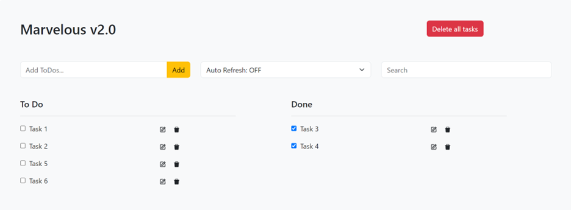

<a name="readme-top"></a>
[![Issues][issues-shield]][issues-url]
[![MIT License][license-shield]][license-url]
[![LinkedIn][linkedin-shield]][linkedin-url]

<br />
<div align="center">
  <a href="https://github.com/KelvinCYDev/marvelous_todo_kelvin_frontend">
    
  </a>

  <h3 align="center">Marvelous V2.0 To Do</h3>

  <p align="center">
    A simple ToDo app!
    <br />
    <br />
    ·
    <a href="https://github.com/KelvinCYDev/marvelous_todo_kelvin_frontend/issues">Report Bug</a>
    ·
    <a href="https://github.com/KelvinCYDev/marvelous_todo_kelvin_frontend/issues">Request Feature</a>

  </p>
</div>

<!-- TABLE OF CONTENTS -->
<details>
  <summary>Table of Contents</summary>
  <ol>
    <li>
      <a href="#about-the-project">About The Project</a>
      <ul>
        <li><a href="#built-with">Built With</a></li>
      </ul>
    </li>
    <li>
      <a href="#getting-started">Getting Started</a>
      <ul>
        <li><a href="#prerequisites">Prerequisites</a></li>
        <li><a href="#installation">Installation</a></li>
      </ul>
    </li>
    <li><a href="#roadmap">Roadmap</a></li>
    <li><a href="#contributing">Contributing</a></li>
    <li><a href="#license">License</a></li>
    <li><a href="#contact">Contact</a></li>
    <li><a href="#acknowledgments">Acknowledgments</a></li>
  </ol>
</details>

<!-- ABOUT THE PROJECT -->

## About The Project

This is a simple full-stack todo app with the following features:

- User can create, update, and delete each To Do tasks.
- Both lists are alphabetically sorted
- User can check and uncheck tasks. The tasks will appear in the corresponding columns ('To Do', 'Done')
- The 'To Do' list is unlimited
- The 'Done' list only shows 10 most recently completed tasks
- Users can select the auto refresh period for the ToDo list (5 sec, 15 seconds, 30 seconds, 1 minute)
- As the user enters text in the search box, both columns are filtered to display only tasks matching the text entered thus far
- User can delete all the tasks at once by pressing 'Delete all tasks'

<p align="right">(<a href="#readme-top">back to top</a>)</p>

### Built With

- [![React][React.js]][React-url]
- [![Vite][Vite]][Vite-url]
- [![Bootstrap][Bootstrap.com]][Bootstrap-url]

<p align="right">(<a href="#readme-top">back to top</a>)</p>

<!-- GETTING STARTED -->

## Getting Started

To get a local copy up and running follow these simple example steps.

### Prerequisites

- yarn

  ```sh
  npm install npm@latest -g
  npm install --global yarn
  ```

### Installation

1. This is just the frontend part, make sure you have setup the backend and running
   ```sh
   https://github.com/KelvinCYDev/marvelous_todo_kelvin_backend
   ```
2. Clone the repo
   ```sh
   git clone https://github.com/KelvinCYDev/marvelous_todo_kelvin_frontend.git
   ```
3. Install YARN packages
   ```sh
   yarn install
   ```
4. Copy .env file from .env.example and make changes if needed
   ```sh
   cp .env.example .env
   ```
5. To run the project
   ```sh
   yarn run dev
   ```

<p align="right">(<a href="#readme-top">back to top</a>)</p>

<!-- ROADMAP -->

## Roadmap

- [x] CRUD for ToDo tasks
- [x] Add "Done" status and timestamp for ToDo tasks
- [x] Allow using checkbox to change To Do status
- [x] ToDo task columns alphabetically ordering
- [x] The 'Done' list only shows 10 most recently completed tasks
- [x] Users can select the auto refresh period for the ToDo list (5 sec, 15 seconds, 30 seconds, 1 minute)
- [x] Searching functionality
- [x] 'Delete all tasks' button

See the [open issues](https://github.com/KelvinCYDev/marvelous_todo_kelvin_frontend/issues) for a full list of proposed features (and known issues).

<p align="right">(<a href="#readme-top">back to top</a>)</p>

<!-- CONTRIBUTING -->

## Contributing

Contributions are what make the open source community such an amazing place to learn, inspire, and create. Any contributions you make are **greatly appreciated**.

If you have a suggestion that would make this better, please fork the repo and create a pull request. You can also simply open an issue with the tag "enhancement".
Don't forget to give the project a star! Thanks again!

1. Fork the Project
2. Create your Feature Branch (`git checkout -b feature/AmazingFeature`)
3. Commit your Changes (`git commit -m 'Add some AmazingFeature'`)
4. Push to the Branch (`git push origin feature/AmazingFeature`)
5. Open a Pull Request

<p align="right">(<a href="#readme-top">back to top</a>)</p>

<!-- LICENSE -->

## License

Distributed under the MIT License. See `LICENSE.txt` for more information.

<p align="right">(<a href="#readme-top">back to top</a>)</p>

<!-- CONTACT -->

## Contact

Kelvin - kelvincyca@gmail.com

Project Link: [https://github.com/KelvinCYDev/marvelous_todo_kelvin_frontend](https://github.com/KelvinCYDev/marvelous_todo_kelvin_frontend)

<p align="right">(<a href="#readme-top">back to top</a>)</p>

<!-- ACKNOWLEDGMENTS -->

## Acknowledgments

Use this space to list resources you find helpful and would like to give credit to. I've included a few of my favorites to kick things off!

- [Choose an Open Source License](https://choosealicense.com)
- [Img Shields](https://shields.io)
- [React Icons](https://react-icons.github.io/react-icons/search)

<p align="right">(<a href="#readme-top">back to top</a>)</p>

[contributors-shield]: https://img.shields.io/github/contributors/KelvinCYDev/marvelous_todo_kelvin_frontend.svg?style=for-the-badge
[contributors-url]: https://github.com/KelvinCYDev/marvelous_todo_kelvin_frontend/graphs/contributors
[forks-shield]: https://img.shields.io/github/forks/KelvinCYDev/marvelous_todo_kelvin_frontend.svg?style=for-the-badge
[forks-url]: https://github.com/KelvinCYDev/marvelous_todo_kelvin_frontend/network/members
[stars-shield]: https://img.shields.io/github/stars/KelvinCYDev/marvelous_todo_kelvin_frontend.svg?style=for-the-badge
[stars-url]: https://github.com/KelvinCYDev/marvelous_todo_kelvin_frontend/stargazers
[issues-shield]: https://img.shields.io/github/issues/KelvinCYDev/marvelous_todo_kelvin_frontend.svg?style=for-the-badge
[issues-url]: https://github.com/KelvinCYDev/marvelous_todo_kelvin_frontend/issues
[license-shield]: https://img.shields.io/github/license/KelvinCYDev/marvelous_todo_kelvin_frontend.svg?style=for-the-badge
[license-url]: https://github.com/KelvinCYDev/marvelous_todo_kelvin_frontend/blob/master/LICENSE.txt
[linkedin-shield]: https://img.shields.io/badge/-LinkedIn-black.svg?style=for-the-badge&logo=linkedin&colorB=555
[linkedin-url]: https://linkedin.com/in/kelvincylau
[product-screenshot]: images/screenshot.png
[Vite]: https://img.shields.io/badge/vite-%23646CFF.svg?style=for-the-badge&logo=vite&logoColor=white
[Vite-url]: https://vitejs.dev/
[React.js]: https://img.shields.io/badge/React-20232A?style=for-the-badge&logo=react&logoColor=61DAFB
[React-url]: https://reactjs.org/
[Bootstrap.com]: https://img.shields.io/badge/Bootstrap-563D7C?style=for-the-badge&logo=bootstrap&logoColor=white
[Bootstrap-url]: https://getbootstrap.com
